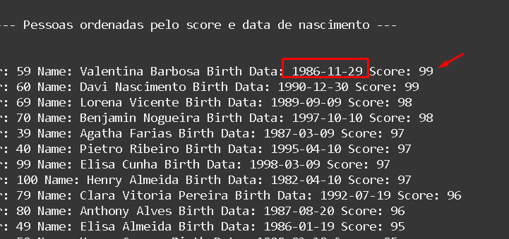
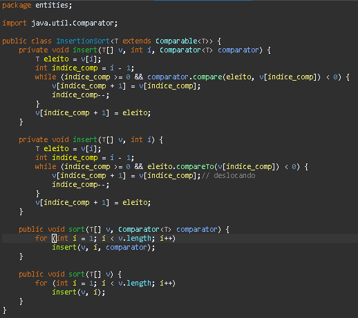
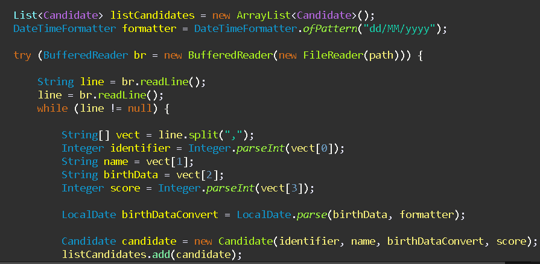
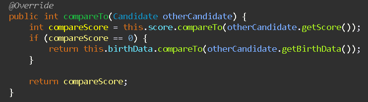
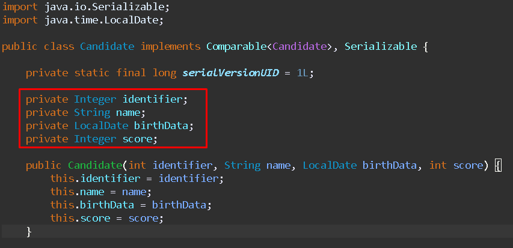

<h1>Ordenação de Candidatos Usando Insertion Sort</h1>

Este programa em Java permite a leitura de um arquivo CSV, desde que o caminho do arquivo seja fornecido. Ele ordena os candidatos com base na nota (score) e, em caso de empate, utiliza a data de nascimento para definir a ordem.

<h3>Sobre o Insertion Sort</h3>

O Insertion Sort é um algoritmo de ordenação que se destaca por sua eficiência em comparação a outros métodos, como o Bubble Sort e o Selection Sort. Sua abordagem mais inteligente e adaptativa para a ordenação o torna uma escolha ideal para esta tarefa.

<h3>Leitura do CSV</h3>

Para a leitura do arquivo CSV, utilizamos as classes <code>BufferedReader</code> e <code>FileReader</code> do Java. O caminho do arquivo é passado como parâmetro, permitindo que o programa acesse e processe os dados de forma eficiente.

<h3>Método de Comparação</h3>

A comparação entre os candidatos é implementada no método <code>compareTo</code> da classe <code>Candidate</code>. Este método retorna um valor inteiro que indica a ordem dos candidatos. Se as notas (scores) forem diferentes, a ordenação é feita com base nelas. Caso contrário, a data de nascimento é utilizada para resolver empates.

<h3>Classe Candidate</h3>

A classe <code>Candidate</code> possui atributos que correspondem às colunas do arquivo CSV. Durante a leitura, cada linha é transformada em uma instância da classe <code>Candidate</code>. O método <code>split</code> é utilizado para separar os dados por vírgula, resultando em um vetor que é passado para o construtor. Esses objetos são então armazenados em um array, permitindo a aplicação do algoritmo Insertion Sort.

